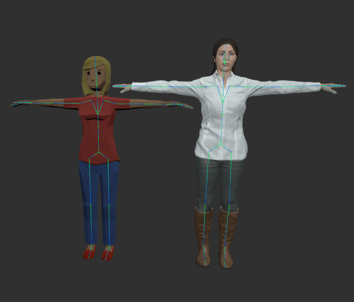
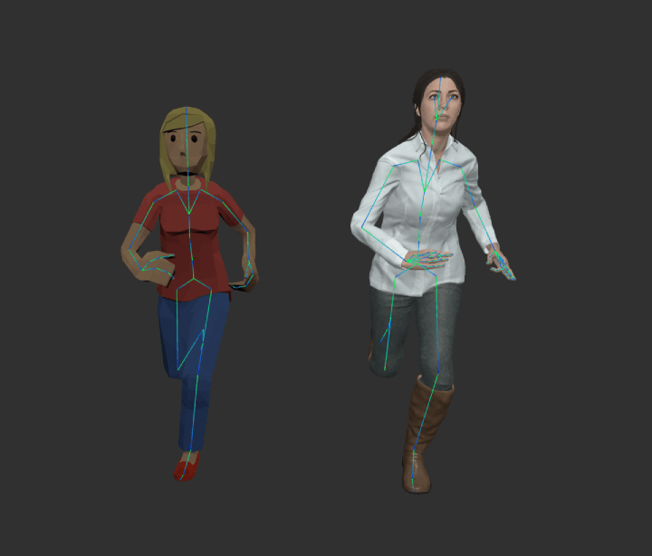

# Understanding the retargeting algorithm 
The algorithm used derives from [this](https://github.com/sketchpunk/FunWithWebGL2/tree/master/lesson_132_animation_retargeting). Given two skeletons, an animation can be approximately retargeted using an auxiliary pose shared by both skeletons. As long as the bone heriarchy and the auxiliary pose of both skeletons are similar, the retargeting can be successfully performed. However, some issues can appear as bone proportions might differ. This might result in missed bone contacts. This algorithm is particularly useful to retarget vague animations such as running or walking.

The skeleton of an avatar is defined by a heriarchy of joints. Each joint is defined by a scale, a rotation and a position, the latter being an offset with respect to its parent. The position with respect to its parent and children, determine in which axis a limb needs to be rotated to achieve a particular pose. This implies that depending on how the skeleton is modeled, the local transforms of a skeleton might differ from others, even if they are successfully applied to the same mesh. The retargeting algorithm attacks this issue by working in world (global) space with an auxiliary pose that looks the same for both skeletons.

The algorithm starts by posing the source and target avatars into the same pose, each with their respective local transforms. 
This ensures each bone to be retargeted has the same direction in world space for each of the avatars. When an animation is applied to the source avatar, each local rotation can be transfered from one avatar to the other by computing the offset with respect to the auxiliary pose. Since both skeleton share the same auxiliary pose, the offset in world space should be the same. Then it is only a matter of changing between local and world spaces.

The rotation (quaternion) computations look as follows (where `bind` means the `auxiliary pose` ):

`trgLocal` = `invBindTrgWorldParent` * `bindSrcWorldParent` * `srcLocal` * `invBindSrcWorld` * `bindTrgWorld`

These arbitrary multiplications can be explained as follows:
- Each bone's new rotation will be transformed isolated from the rest of the other bone's new rotations. Instead, the auxiliary pose will be used for the rest of the bones. 
- srcWorldRot = `bindSrcWorldParent` * `srcLocal`: compute world rotation of the avatar with this bone's new rotation and the auxiliary pose for the rest of the bones.
- offsetWorldRot = srcWorldRot * `invBindSrcWorld`: by multiplying on the right by the inverse of the auxiliary pose __(including the current bone)__, the auxiliary pose is removed and results in the __world offset rotation__. Note: Multiplying by the left instead, would result in the local offset rotation.
- trgWorldRot = offsetWorldRot * `bindTrgWorld`: add the offset to the target skeleton's auxiliary pose. Since both source and target poses are the same, the same movement should be expected.
- `trgLocalRot` = `invBindTrgWorldParent` * trgWorldRot: by multplying on the left by the inverse of the auxiliary pose __(excluding the current bone)__, the parent's auxiliary pose is removed and results in the __local retargeted bone rotation__. The current bone needs to be excluded from the inverse because the complete local retargeted rotation is desired, not just the offset with respect to the auxiliary pose. 

The implemented algorithm uses a more sophisticated approach which applies some extra world rotation as, sometimes, it is easier to modify the container of the skeleton, rather than the actual skeleton in order to build the auxiliary pose. 

trgLocal = invBindTrgWorldParent * `invTrgEmbedded` * `srcEmbedded` * bindSrcWorldParent * srcLocal * invBindSrcWorld * `invSrcEmbedded` * `trgEmbedded` * bindTrgWorld