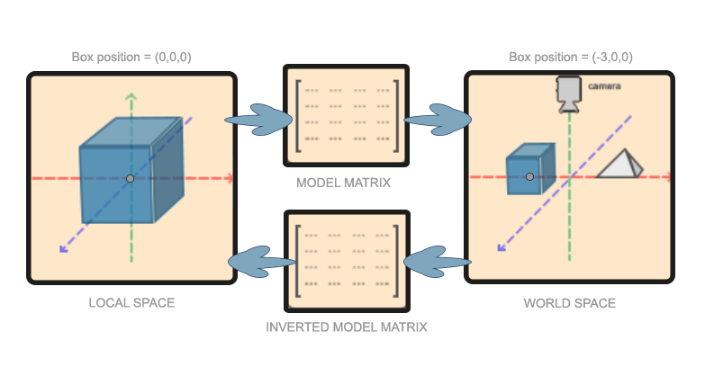

# RETARGETING
<b>Animation retargeting</b> is the process of transferring an animation from one character (the source) to another character (the target) that may have different proportions, joint structures, or skeletal configurations. This technique is widely used in computer graphics, particularly in video games and film production, to reuse animations across different characters, saving time and resources.

## Key concepts

### Spaces
For animation, and specifically, for retargeting is very important the space used when computing bone's transformations so the results can be very different:

- <b>World space</b> or <b>Global Space</b>: Object transformation based upon its place in the world view, that is, relative to the (0,0,0) of the world.
- <b>Local space:</b> Object transformation relative to its parent.

### Source and Target Characters
- <b>Source Character:</b> Original character that has the animation data
- <b>Target Character:</b> Character that will receive the animation

### Skeleton
The skeleton of an avatar is defined by a heriarchy of <b>joints</b> (defined by positions) or <b>bones</b> (defined by an initial position, direction and length), depending of the software. Each joint has a <b>scale</b>, a <b>rotation</b> and a <b>position</b>, the latter being an offset with respect to its parent. The position with respect to its parent and children, determine in which axis a limb needs to be rotated to achieve a particular pose. This implies that depending on how the skeleton is modeled, the local transforms of a skeleton might differ from others, even if they are successfully applied to the same mesh. The retargeting algorithm attacks this issue by working in <b>world space</b> with an auxiliary pose that looks the same for both skeletons.

#### Skeleton Mapping

To perform a retargeting, a correspondence between the joints of the <b>source skeleton</b> and the <b>target skeleton</b> has to be established. Not only for the names, also for the missing joints if it’s the case. This often requires manual setup or the use of automated algorithms.

### Poses
A <b>pose</b> is a particular configuration of the transformation (<b>position</b>, <b>rotation</b> and <b>scale</b>) of the bones/joints of a skeleton. The most common poses are the following:
- <b>Bind Pose:</b> Default initial pose for the skeleton before it is animated. Used as a reference for attaching/binding the mesh to the bones (skinning). Usually, the pose shapes a T (<b>T-pose</b>) or an A (<b>A-pose</b>)
- <b>Rest Pose:</b> Default or neutral pose of the skeleton when no transformations or animations are applied. It is likely that this pose will be the same as the bind pose.

## Understanding the retargeting algorithm 
The algorithm used derives from [this](https://github.com/sketchpunk/FunWithWebGL2/tree/master/lesson_132_animation_retargeting). Given two skeletons, an animation can be approximately retargeted using an auxiliary pose shared by both skeletons. As long as the bone heriarchy and the auxiliary pose of both skeletons are similar, the retargeting can be successfully performed. However, some issues can appear as bone proportions might differ. This might result in missed bone contacts. This algorithm is particularly useful to retarget vague animations such as running or walking.

### 1. Joint mapping
The algorithm starts mapping each joint of the source skeleton to a corresponding joint in the target skeleton by name. In this approach, the same skeleton structure is assumed, so the mapping is one-to-on. But some joints may need to be interpolated if the skeleton has a different structure.

### 2. Skeleton preparation 

Once the mapping is done, the next step is posing the source and target avatars into the same pose, each with their respective local transforms. 

This ensures each bone to be retargeted has the same direction in world space for each of the avatars. 

### 3. Retarget joint transformations
When an animation is applied to the source avatar, each local rotation can be transfered from one avatar to the other by computing the offset with respect to the auxiliary pose. Since both skeleton share the same auxiliary pose, the offset in world space should be the same. Then it is only a matter of changing between local and world spaces.

The rotation (quaternion) computations look as follows (where `bind` means the `auxiliary pose`):

`trgLocal` = `invBindTrgWorldParent` * `bindSrcWorldParent` * `srcLocal` * `invBindSrcWorld` * `bindTrgWorld`

These arbitrary multiplications can be explained as follows:
- Each bone's new rotation will be transformed isolated from the rest of the other bone's new rotations. Instead, the auxiliary pose will be used for the rest of the bones. 
- srcWorldRot = `bindSrcWorldParent` * `srcLocal`: compute world rotation of the avatar with this bone's new rotation and the auxiliary pose for the rest of the bones.
- offsetWorldRot = srcWorldRot * `invBindSrcWorld`: by multiplying on the right by the inverse of the auxiliary pose __(including the current bone)__, the auxiliary pose is removed and results in the __world offset rotation__. Note: Multiplying by the left instead, would result in the local offset rotation.
- trgWorldRot = offsetWorldRot * `bindTrgWorld`: add the offset to the target skeleton's auxiliary pose. Since both source and target poses are the same, the same movement should be expected.
- `trgLocalRot` = `invBindTrgWorldParent` * trgWorldRot: by multplying on the left by the inverse of the auxiliary pose __(excluding the current bone)__, the parent's auxiliary pose is removed and results in the __local retargeted bone rotation__. The current bone needs to be excluded from the inverse because the complete local retargeted rotation is desired, not just the offset with respect to the auxiliary pose. 

The implemented algorithm uses a more sophisticated approach which applies some extra world rotation as, sometimes, it is easier to modify the container of the skeleton, rather than the actual skeleton in order to build the auxiliary pose. 

trgLocal = invBindTrgWorldParent * `invTrgEmbedded` * `srcEmbedded` * bindSrcWorldParent * srcLocal * invBindSrcWorld * `invSrcEmbedded` * `trgEmbedded` * bindTrgWorld